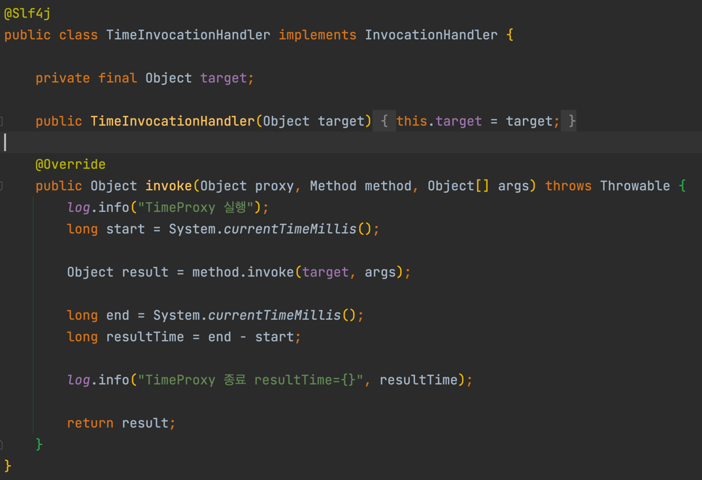

# JAVA 리플렉션
- JVM에 등록되는 메타데이터를 이용하여 동적으로 프록시를 생성할 수 있다.
## 예제


- ```Class.forName```을 이용해서 클래스 정보를 받아온다.
- ```classHello.getMethod("callA")``` 처럼 메소드를 Stirng으로 넘겨서 동적으로 생성할 수 있다.


- 위 예제처럼 메소드를 생성해서 파라미터로 받으면 공통 로직을 조금 더 줄일 수 있다.

# JDK 동적 프록시
- JDK에서 제공하는 프록시인데 동적으로 생성이 가능하다.
- 하지만 인터페이스를 이용하기 떄문에 인터페이스가 필수다.
- 기존에 프록시 패턴을 이용할 때에는 클래스마다 프록시를 하나씩 생성해 주어야 했는데 JDK 동적 프록시를 이용해서 각각 프록시를 생성하지 않아도 된다.

## 예제


- ```InvocationHandler``` 클래스를 상속 받아서 ```invoke``` 메소드를 오버라이딩 하여 구현해준다.


- 이런 식으로 사용하면 된다. 
- 직접 사용할 일은 거의 없어서 기억만 해두면 좋을 거 같다.

# CGLIB 프록시
- 스프링에서 제공하는 프록시로서 구체 클래스만 존재할 때에도 사용이 가능하다.

## 예제


- Spring에서 제공하는 CGLib을 이용하여 ```MethodInterceptor``` 클래스를 상속받아 구현해준다.


- JDK 동적 프록시와 다르게 ```Enhancer```를 이용하여 구현 클래스를 넣어준다.
- 어떤 식으로 사용하는지 알아만 두자.