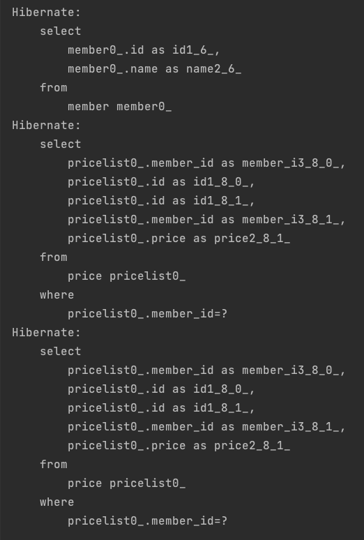
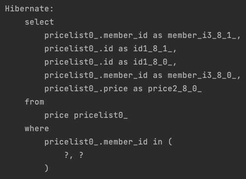
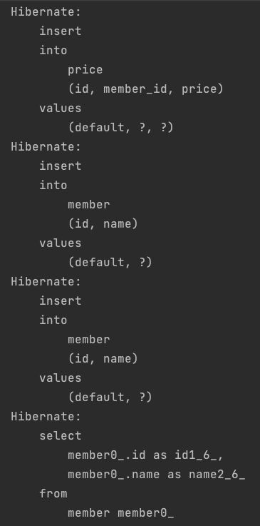
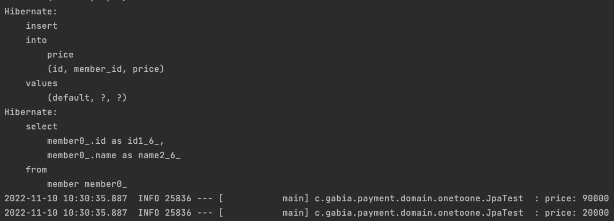

# JPA N+1 정리
- Jpa를 이용한 쿼리 실행 시, 각 row 별 연관관계 쿼리를 실행하는 문제로 row의 수만큼 N번 실행되는 현상을 말한다.

## 즉시 로딩 (Eager Loading)
- 해당 entity와 연관된 entity까지 모두 조회하는 방식
- findById 같은 @Id 기준 쿼리 조회를 제외하는 경우에서 최초 쿼리 실행 후 그 연관관계를 조회하기 위해 N+1 만큼의 쿼리가 실행 된다. 
- findAll 같은 메소드를 실행하면 자식 메소드까지 영속화 하기 위해서 N+1만큼의 쿼리가 실행되게 된다.
- 즉시로딩의 경우 findById(@ID)를 사용하는 경우는 자체적으로 inner join 형태의 쿼리를 만들어서 조회하기 때문에 n+1 문제가 발생하지 않는다.
- 하지만 그 외에 경우에는 쿼리를 최적화를 하지 못하므로 여러번 실행되게 된다.

### 예제
#### Entity
```java
public class Member {

    @Id
    @GeneratedValue(strategy = GenerationType.IDENTITY)
    private Long id;
    private String name;

    @OneToMany(mappedBy = "member", fetch = FetchType.EAGER)
    private List<Price> priceList = new ArrayList<>();
}
```
```java
public class Price {

    @Id
    @GeneratedValue(strategy = GenerationType.IDENTITY)
    private Long id;
    private Long price;

    @ManyToOne
    @JoinColumn(name = "member_id")
    private Member member;
}
```
- Member와 Price는 1:N 관계

#### Test
```java
@Test
void manyToOneTest() {

    Price price = Price.builder()
        .price(90000L)
        .build();

    priceRepository.save(price);

    Member member1 = Member.builder()
        .name("one")
        .build();

    Member member2 = Member.builder()
        .name("one")
        .build();

    memberRepository.save(member1);
    memberRepository.save(member2);

    List<Member> all = memberRepository.findAll();
}
```
- price를 2개 입력하고 member는 1개 입력한 후 findAll() 메소드 실행

#### 결과


- 입력한 price의 수만큼 price 조회 쿼리 실행

### 해결 방법
#### 지연 로딩 사용
- 지연 로딩을 사용한다고 N+1 문제가 발생 안하지는 않지만 아래쪽 지연 로딩 쪽에서 해결 방법을 설명
- entity 설계 시 기본적으로 지연 로딩으로 설정해두고 사용하는것을 추천.
#### Batch Size 사용
- batch size를 설정하면 in 쿼리 형태로 아래와 같이 실행된다.

```
spring:
  jpa:
    properties:
      hibernate:
        default_batch_fetch_size: 100
```

  
## 지연 로딩 (Lazy Loading)
- 연관된 entity를 프록시 객체로 가지고 있고 실제로는 해당하는 entity만 조회하는 방식
- 어떤 메소드를 사용하던 쿼리는 한번만 실행되겠지만, 자식 메소드(현재 프록시 객체)를 사용하게 되는 순간 N+1의 쿼리가 실행되게 된다.

### 예제
```java
public class Member {

    @Id
    @GeneratedValue(strategy = GenerationType.IDENTITY)
    private Long id;
    private String name;

    @OneToMany(mappedBy = "member", fetch = FetchType.LAZY)
    private List<Price> priceList = new ArrayList<>();
}
```
```java
public class Price {

    @Id
    @GeneratedValue(strategy = GenerationType.IDENTITY)
    private Long id;
    private Long price;

    @ManyToOne
    @JoinColumn(name = "member_id")
    private Member member;
}
```
- Member쪽에 Lazy로 설정 (실제로 default 값도 Lazy다.)

```java
@Test
 void manyToOneTest() {

     Price price = Price.builder()
         .price(90000L)
         .build();

     priceRepository.save(price);

     Member member1 = Member.builder()
         .name("one")
         .build();

     Member member2 = Member.builder()
         .name("one")
         .build();

     memberRepository.save(member1);
     memberRepository.save(member2);

     List<Member> all = memberRepository.findAll();
 }
```



- entity insert 후에 findAll 조회를 해도 member만 조회 된다.

```java
@Test
@Transactional
void manyToOneTest() {

  List<Member> all = memberRepository.findAll();

  all.forEach(member -> {
      List<Price> priceList1 = member.getPriceList();
      priceList1.forEach(price -> {
          log.info("price: {}", price.getPrice());
      });
  });
}
```
- 이제 연관 관계까지 가져와서 출력해보자.



- 자식 관계가 조회되지 않고 바로 출력되고 있다.
- 그 이유는 상단에서 entity를 입력한 후 영속성이 유지되어서 따로 조회를 하지 않아도 되는 것이다.
- 만약 entity가 기존에 존재하고 findAll 메소드로 조회하는 경우라면 n+1 문제가 발생할 것이다.

### 해결
#### Fetch join
- 지연로딩의 n+1을 해결할 수 있는 방법
- fetch join을 사용하면 확정된 값을 한번에 조인하여 가져온다.
- Pagination이나 2개 이상의 collection join에서 문제가 발생 
#### Batch Size 사용
   - batch size를 설정하면 in 쿼리 형태로 아래와 같이 실행된다.

## Pagination
- fetch join 시 limit, offset을 통한 쿼리가 아닌 인메모리에 모두 가져와 application단에서 처리하여 OOM 발생
- BatchSize를 통해 필요 시 배치쿼리로 원하는 만큼 쿼리를 날림 > 쿼리는 날아가지만 N번 만큼의 무수한 쿼리는 발생되지 않음

## 2개 이상의 Collection join
- List 자료구조의 2개 이상의 Collection join(~ToMany관계)에서 fetch join 할 경우 MultipleBagFetchException 예외 발생
- Set자료구조를 사용한다면 해결가능 (Pagination은 여전히 발생)
- BatchSize를 사용한다면 해결가능 (Pagination 해결)
