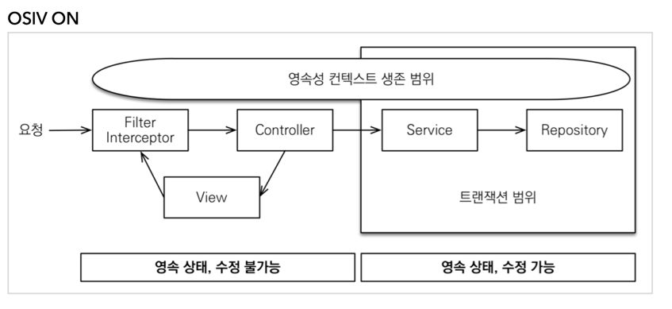
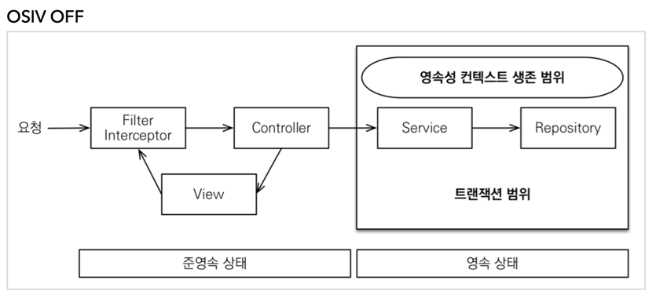

# OSIV (open-session-in-view)
- open session in view (하이버네이트)
  - jpa가 생기기 전까지는 ```entityManager```를 ```session```으로 불렀다.
- open entityManager in view (JPA)
  - jpa가 생기고 ```osiv```는 ```oeiv```로 바뀌었지만 관례상 ```osiv```로 불린다.

## OSIV ON

> 출처: [실전! 스프링 부트와 JPA 활용2 - API 개발과 성능 최적화](https://www.inflearn.com/course/%EC%8A%A4%ED%94%84%EB%A7%81%EB%B6%80%ED%8A%B8-JPA-API%EA%B0%9C%EB%B0%9C-%EC%84%B1%EB%8A%A5%EC%B5%9C%EC%A0%81%ED%99%94/dashboard)
- 데이터베이스 커넥션 시작부터 api 응답이 끝나는 순간까지 영속성 컨텍스트가 유지됨
- 오랜 시간 데이버베이스 커넥션을 사용하기 때문에 커넥션이 모자라 장애로 이어질 수 있음.

## OSIV OFF

> 출처: [실전! 스프링 부트와 JPA 활용2 - API 개발과 성능 최적화](https://www.inflearn.com/course/%EC%8A%A4%ED%94%84%EB%A7%81%EB%B6%80%ED%8A%B8-JPA-API%EA%B0%9C%EB%B0%9C-%EC%84%B1%EB%8A%A5%EC%B5%9C%EC%A0%81%ED%99%94/dashboard)
- osiv가 off 라면 트랜잭션을 종료할 때 영속성 컨텍스트를 닫고 데이터베이스 커넥션도 반환
- 때문에 커넥션 리소스 낭비 방지 가능
- api 서버와 front 서버를 분리하여 개발하는 요즘에는 off로 사용하는 것이 성능상으로 이점이 있다.

## 커맨드와 쿼리 분리
- Command와 Query를 분리하여 관리
- 보통 등록/수정은 성능상 크게 문제가 되지 않음
- 성능상 이슈가 많은 조회 부분을 한 곳에 모아 관심사를 분리
- 유지보수 편의성 증가