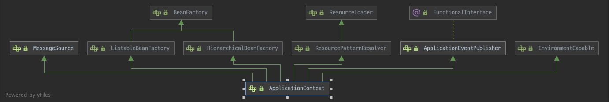

# Spring Application 소스 코드 분석

## Application Context
 ```bean```들의 생성과 의존성 주입 등의 역할을 하는 일종의 ```DI 컨테이너```이다. 이름 그래도 번역하면 애플리케이션 실행 환경이지만 ```DI 컨테이너```라고도 불리는 이유는 ```bean```들을 생성하는 ```BeanFactory``` 인터페이스를 부모로 상속받고 있기 때문이다.



여기서 ```ApplicationContext``` 인터페이스가 상속 받고 있는 몇가지 인터페이스를 알아볼 것이다. ```ApplicationContext``` 인터페이스는 ```BeanFactory``` 인터페이스를 직접 상속하지 않고 ```ListableBeanFactory```, ```HierarchicalBeanFactory``` 인터페이스를 통해서 상속받고 있다.  

### ListableBeanFactory
동일한 타입의 ```bean```이 여러개 존재하는 경우에는 List 형식으로 ```bean```을 찾아서 주입해주는 클래스

### HierarchicalBeanFactory
부모 자식 관계 설정을 위한 인터페이스이다.
> Hierarchical는 계층적 이라는 뜻이다.
w
### AutowireCapableBeanFactory

> 합성 관계란 (has-a) 전체를 표현하는 객체가 부분을 표현하는 객체를 포함해서 부분 객체의 코드를 재사용 하는 것을 말한다.